# Pyroscope架构

## 关于架构

* Pyroscope有一个基于微服务的架构
  * 系统有多个水平可伸缩的微服务,能独立或者并行运行都可以
  * 这些微服务都称为组件(component)
* Pyroscope设计上将所有组件的代码编译成同一个二进制文件
  * `-target` 参数控制这个单一二进制文件作为什么组件运行
  * 对于那些希望以简单方式入门的用户，Pyroscope 也支持单体模式，所有组件在同一个进程中同时运行。

### Pyroscope组件

* 大部分组件都是无状态的, 在进程重启之间不需要任何持久化数据.
* 部分组件是有状态的,依赖非易失性存储在进程重启之间防止数据丢失
* 有关每个组件的详细信息，请参阅“组件”中的相应页面。

#### 写路径

<p align="center">
  <a href="./images/write-path.svg">
    
  </a>
</p>
<p align="center"><sub>写入路径示意图</sub></p>
* ingesters从distributor (distributors)接收传入的profiles。
  * 每个推送请求都属于一个租户
  * ingester会将接收到的profiles追加到存储在本地磁盘上的每租户的 Pyroscope 数据库中。
* 每个ingester会在收到该租户的第一个profiles后立即创建该租户的 Pyroscope 数据库。
* 在内存中的profiles会定期刷新到磁盘并创建新的数据块。

#### 系列分片和复制

* 默认情况下，每个profile系列的数据会被复制到三个ingesters，每个 ingesters 会将自己的数据块写入长期存储。
* compactor 会将来自多个ingesters的数据块合并成一个数据块，并删除重复的sample。
* 数据块压缩可以显著降低存储占用率。

#### 读路径

<p align="center">
  <a href="./images/read-path.svg">
    
  </a>
</p>
<p align="center"><sub>读路径示意图</sub></p>

* 进入 Pyroscope 的查询会到达query-frontend组件(query-frontend)，该组件负责加速查询并将其分发给查询调度器(query-scheduler)。
* 查询调度器(query-scheduler)维护一个查询队列，并确保每个租户的查询都能得到公平执行。
* 查询器(queriers)充当工作进程，从查询调度器的队列中提取查询。
  * 查询器(queriers)连接到ingesters，以获取执行查询所需的所有数据。
* 根据所选的时间窗口，querier会调用ingester来获取近期数据，并调用存储网关(store-gateways)来获取长期存储中的数据。

#### 长期存储

* Pyroscope 存储格式的详细描述请参见块格式页面。
* Pyroscope 存储格式将每个租户的profiles存储到其自身的磁盘块中。
  * 每个磁盘块目录包含一个索引文件、一个元数据文件以及 Parquet 表。
* Pyroscope 需要以下任一对象存储来存放块文件：
  * Amazon S3
  * Google Cloud Storage
  * Microsoft Azure Storage
  * OpenStack Swift
  * 本地文件系统（仅限单节点）

## 部署模式

* Pyroscope 官方支持两种部署模式:
  * 单体模式
    * 在此模式下，所有组件都在单个进程中运行
    * 适用于只需要一个pyroscope实例的情况，因为多个实例之间不会共享信息。
  * 微服务模式
    * 在这种模式下，随着实例数量的增加，它们将共享同一个后端进行存储和查询。
* 部署模式由 -target 参数决定，可以通过 CLI 标志或 YAML 配置设置该参数。

### 单体模式


* 单体模式会在单个进程中运行所有必需组件，这是默认的运行模式
  * 可以通过指定 `-target=all` 来设置
* 单体模式是部署 Pyroscope 最简单的方法
  * 如果您想要快速入门或在开发环境中使用 Pyroscope，则非常有用。
* 要查看当 `-target` 设置为 `all` 时运行的组件列表，请使用 `-modules` 标志运行 Pyroscope：
```bash
./pyroscope -modules
```

### 微服务模式


* 在微服务模式下，组件部署在独立的进程中。
* 扩展是按组件(per component)进行的
  * 这使得扩容更加灵活
  * 故障域控制也更加细粒度
* 微服务模式是生产环境部署的首选方法，但也最为复杂。
* 在微服务模式下，每个 Pyroscope 进程都是通过 `-target` 参数设置为特定的 Pyroscope 组件（例如，`-target=ingester` 或 `-target=distributor`） 来调用的
* 要获得一个可用的 Pyroscope 实例，您必须部署所有必需的组件。


## 组件

Pyroscope 包含一系列相互协作以形成集群的组件。

* Distributor
* Ingester
* Store-gateway
* Compactor
* Querier
* Query-frontend
* Query-scheduler

### distributor

* distributor 是一个无状态组件，它从agent接收分析数据。
* distributor 将数据分成多个批次，并行发送到多个ingester，并将数据series分片(shards)到各个 ingester ，并按照配置的复制因子复制每个序列。
  * 默认情况下，配置的复制因子为 3。

#### 校验

* distributor 在将数据写入 ingester 之前​​，会对接收到的数据进行清理和验证。
  * 由于单个请求可能包含有效和无效的 profiles、samples、metadata和exemplars，distributor 仅将有效数据传递给数据ingester。
  * distributor 不会在其发送给数据ingester的请求中包含无效数据。
  * 如果请求包含无效数据，distributor 将返回 400 HTTP 状态码，并在响应正文中显示详细信息。
  * agent通常会记录第一个无效数据的详细信息。
* distributor 的数据清理包括以下转换
  * 确保 profile 已设置时间戳，否则将默认为 distributor 接收到profile的时间。
  * distributor 将删除值为 0 的 samples ，并将具有相同堆栈跟踪的samples相加。

#### 复制(Replication)

* distributor 将传入的序列(series)分片(shards)并复制(replicates)到各个ingester
  * 您可以通过 `-distributor.replication-factor` 标志配置每个序列写入的ingester 副本数量，默认值为 1。
  * distributor 使用一致性哈希算法，并结合可配置的复制因子，来确定哪些ingester 接收给定的序列。
* Sharding和 replication 使用ingester 的哈希环
  * 对于每个传入的序列，distributor 使用 profile名称、标签和TenantID 计算哈希值。
  * 计算出的哈希值称为令牌。
  * distributor 在哈希环中查找令牌，以确定将序列写入哪些ingester。

##### 仲裁一致性

* 由于distributor 共享对同一哈希环的访问权限，因此写入请求可以发送到任何distributor
  * 您还可以在其前面设置无状态负载均衡器。
* 为了确保查询结果的一致性，Pyroscope 在读取和写入操作中使用 Dynamo 风格的仲裁一致性(quorum consistency)。
  * distributor 等待 (n/2 + 1) 个ingester 成功响应, 其中 n 是配置的复制因子, 然后才会向agent推送请求发送成功响应。

#### 在多个 distributors 之间的负载均衡

* 我们建议在distributor实例之间随机分配写入请求的负载
  * 如果您在 Kubernetes 集群中运行 Pyroscope，则可以将 Kubernetes Service 定义为distributor的入口。
* 注意： 存在HTTP级别的请求分布不均的可能性
  * Kubernetes Service 负责在 Kubernetes 端点之间平衡 TCP 连接，但不会平衡单个 TCP 连接内的 HTTP 请求。
  * 如果您启用了 HTTP 持久连接（HTTP keep-alive），由于 Agent 使用了 HTTP keep-alive，它会为每个推送 HTTP 请求重用同一个 TCP 连接。
  * 这可能会导致distributor接收到的推送 HTTP 请求分布不均。

### ingester

* ingester 是一个有状态组件
  * 在写入路径上, 它首先将传入的profile写到磁盘存储
  * 在读取路径上, 返回series samples以供查询使用
* 来自distributor 的传入profile 不会立即写入长期存储，而是保存在ingester的内存中或卸载(offloaded)到ingester的磁盘上。
  * 最终，所有profile 都会写入磁盘并定期上传到长期存储。
  * 因此，queriers在读取路径上执行查询时，可能需要同时从ingester和长期存储中获取samples。
* 任何调用ingesters的 Pyroscope 组件首先会查找哈希环(hash ring)中注册的ingester，以确定哪些ingester可用。
* 每个 ingester 可能处于以下状态之一：
  * PENDING
    * ingester刚刚启动。
    * 在此状态下，ingester不接收写入或读取请求。
  * JOINING
    * ingester启动并加入环。
    * 在此状态下，ingester不接收写入或读取请求。
    * ingester从磁盘加载令牌（如果配置了 `-ingester.ring.tokens-file-path`），或者生成一组新的随机令牌。
    * 最后，ingester（可选）会观察环中是否存在令牌冲突，冲突解决后，将进入ACTIVE状态。
  * ACTIVE
    * ingester正在运行。
    * 在此状态下，ingester可以接收写入和读取请求。
  * LEAVING
    * ingester正在关闭并离开环。
    * 在此状态下，ingester不接收写入请求，但仍可以接收读取请求。
  * UNHEALTHY
    * ingester未能向哈希环发送心跳信号。
    * 在此状态下，distributor 会绕过ingester，这意味着ingester不会接收写入或读取请求。

#### ingester写入去放大

* ingester会将最近接收到的sample存储在内存中，以便对write做去放大(de-amplification)。
  * 如果ingester立即将接收到的sample写入长期存储，由于长期存储压力过大，系统将难以扩容。
  * 因此，ingester会对内存中的samples进行batch和压缩，并定期将其上传到长期存储。
* 写入去放大是 Pyroscope 总体拥有成本 (TCO: total cost of ownership) 低的主要原因。

#### ingester故障和数据丢失

* 如果ingester进程崩溃或突然退出，所有尚未上传到长期存储的内存中的profile都可能丢失。

* 以下方法可以缓解这种故障模式：Replication

##### Replication

* 默认情况下，每个profile series 都会复制到三个ingester
  * 如果至少有两个ingester接收到数据（复制因子为 3），则写入 Pyroscope 集群的操作才算成功。
  * 如果 Pyroscope 集群丢失一个ingester，则丢失ingester的头块中保存的内存profile至少可以在另一个ingester中找到。
* 如果只有一个ingester发生故障，则不会丢失任何profile。
* 如果多个ingester发生故障，并且故障影响到所有保存特定profile series副本的ingester，则profile可能会丢失。

### Store-gateway

* Pyroscope 中的存储网关负责在长期存储桶中查找profiling data
  * 单1个存储网关负责长期存储中的一部分数据块(子集)，并由querier调用。

### compactor

* compactor通过合并数据块来提高查询性能并减少长期存储占用。
* compactor负责以下功能：
  * 将给定租户的多个数据块压缩成一个经过优化的更大数据块。
    * 这可以去除重复数据并减小索引大小，从而降低存储成本。
    * 查询更少的数据块速度更快，因此也能提高查询速度。
  * 保持每个租户的存储桶索引(bucket index)更新
    * 查询器(queriers)和存储网关(store-gateways)使用存储桶索引(bucket index)来发现存储中的新数据块和已删除数据块。
* compactor是无状态的。

#### 压缩是怎么工作的

#### 扩容

#### 压缩算法

#### 压缩分片

#### 压缩job顺序

#### 块删除

#### 压缩磁盘利用率

### querier

* querier是一个无状态组件
* 它通过获取读取路径上的profiles series和labels来对查询表达式进行计算
* querier使用ingesters 收集最近写入的数据，并使用store-gateways进行长期存储。

#### 连接到 ingesters

* 您必须使用与配置ingesters相同的 `-ingester.ring.*` 标志（或其各自的 YAML 配置参数）来配置querier，以便querier可以访问ingesters哈希环并发现ingesters的地址。

### query-frontend

* query-frontend是一个无状态组件，它提供与 querier相同的 API
  * 可用于加速读取路径，并通过 query-scheduler 确保租户之间的公平调度。
* 在这种情况下，queriers充当工作进程，从队列中拉取任务，执行任务，并将结果返回给query-frontend进行聚合。
* 出于高可用性的考虑，我们建议您至少运行两个query-frontend副本。
* 由于使用query-frontend时必须同时运行query-scheduler，因此您必须至少运行一个query-scheduler副本。
* 以下步骤描述了查询如何在query-frontend中流转。
  * query-frontend接收查询
  * query-frontend通过与query-scheduler通信，将查询放入队列中，等待querier领取。
  * querier从队列中领取查询并执行它。
  * querier将结果返回给query-frontend，然后query-frontend汇总结果并将其转发给客户端。

### query-scheduler

* 查询调度器是一个无状态组件，它维护一个待执行查询队列，并将工作负载分配给可用的查询器。
* 使用query-frontend时，查询调度器是必需组件。


* 以下流程描述了一次查询在 Pyroscope 集群中的流转过程：
  * query-frontend(query-frontend)接收查询，然后将其拆分和分片，或从缓存中提供服务。
  * query-frontend(query-frontend)将查询放入查询调度器的队列中。
  * 查询调度器(query-scheduler)将查询存储在内存队列中，等待查询器(querier)领取。
  * 查询器(querier)领取查询并执行。
  * 查询器(querier)将结果发送回query-frontend(query-frontend)，query-frontend(query-frontend)再将结果转发给客户端。

#### 使用query-scheduler的优势

* 查询调度器支持query-frontend的扩容。

#### 配置

* 要使用查询调度器，query-frontend和查询器需要发现查询调度器实例的地址。
* 查询调度器使用基于环的服务发现机制来发布自身，该机制通过成员列表配置进行配置。

#### 运维注意事项

* 为了实现高可用性，请运行两个查询调度器副本。

## bucket index

## Block format

* 本文档描述了 Pyroscope 如何将数据存储在其数据块中。
  * 每个数据块(block)属于一个租户，并由唯一的 ULID 标识。
    * [ULID](https://github.com/ulid/spec)
  * 数据块(block)内包含多个文件：
    * 元数据文件 meta.json
      * 其中包含有关数据块内容的信息
      * 例如profiling数据的时间范围
    * TSDB 索引 index.tsdb
      * 将外部标签映射到存储在 profiles 表中的profiles
    * profiles.parquet
      * 包含profiles的 Parquet 表
    * symbols.symdb
      * 包含存储在block的profiles的符号信息。

### 数据模型

* block内的数据模型与 Google 的 pprof wire format的 proto 定义基本一致。
* Profile series labels 包含在数据ingestion时收集的附加信息，可用于选择特定的profiles。
  * 它们类似于 Prometheus/Loki labels，典型的labels名称为namespace和 Pod，用于描述profiles来自哪个工作负载。
* 每个ingested的profile都会添加到 profile 表中的新行中。
  * 如果不同型号的表格中缺少条目，也会将其插入。


## hash rings

## memberlist and gossip protocol

## 参考文档

1. [Pyroscope architecture](https://grafana.com/docs/pyroscope/latest/reference-pyroscope-architecture/)